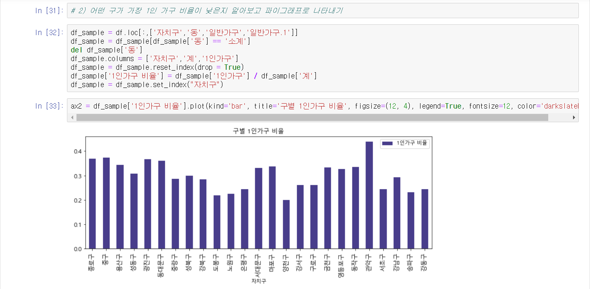
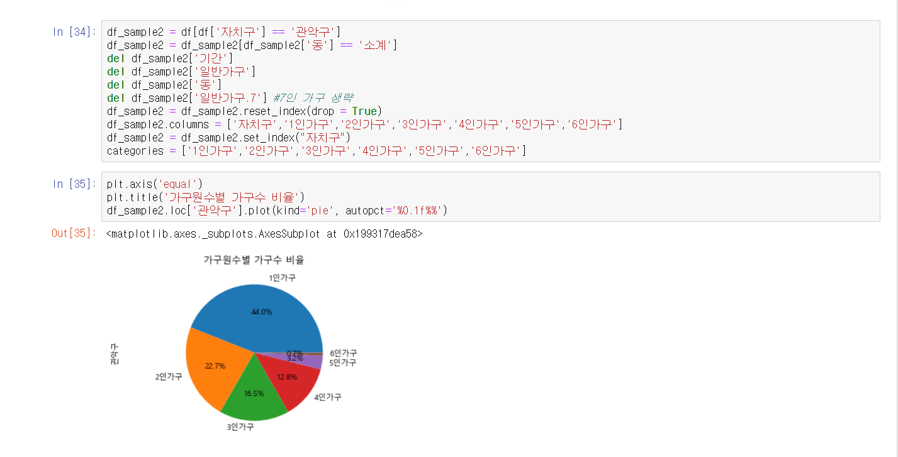
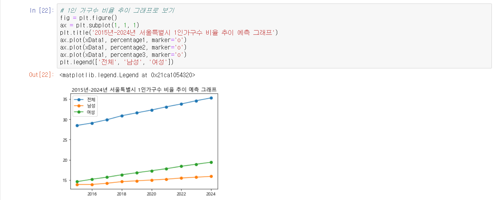
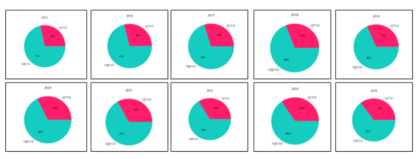

# An-Analysis-of-Household-Form-and-Single-person-Households-in-Seoul
Numpy, Pandas, Tensorflow를 통한 서울특별시 가구 형태 및 1인 가구 분석

> ### 공공데이터
 * 기말프로젝트_Tensorflow.ipynb  
  * 서울시 1인가구(거처종류별) 통계  
  * 서울시 1인가구(연령별) 통계  
  * 서울시 1인가구(혼인상태별) 통계  
  * 서울시 가구원수별 가구수(동별) 통계  
  * 서울시 가구형태별 가구 및 가구원(동별) 통계  
 * 기말프로젝트_Tensorflow.ipynb  
  * 서울특별시총가구
  * 연도별1인기구통계
  
-------------------------------------------------------------------------------------------------------------
[출처] 서울 열린 데이터 광장  
https://data.seoul.go.kr/dataList/datasetList.do  
[출처] KOSIS 국가통계포털  
http://kosis.kr/statisticsList/statisticsListIndex.do?menuId=M_01_01&vwcd=MT_ZTITLE&parmTabId=M_01_01  

> ### 소스코드
 * 5개에 대한 공공데이터 분석 소소코드  
 * Tensorflow 이용한 1인 가구 수 추이 분석 소스코드

> ### 사용기술

 * 기말프로젝트.ipynb  
 
<pre>
<code>
import pandas as pd
import numpy as np
import matplotlib.pyplot as plt
from matplotlib import font_manager, rc
from matplotlib import style
</code>
</pre>

 * 기말프로젝트_Tensorflow.ipynb  
 
<pre>
<code>
import tensorflow as tf
import pandas as pd
import numpy as np
import matplotlib.pyplot as plt
from matplotlib import font_manager, rc
from matplotlib import style
</code>
</pre>

<pre>
<code>
# 서울특별시 1인가구수 학습
W = tf.Variable(tf.random.uniform([1], -100, 100)) # -100부터 100까지 랜덤한 값을 가진다
b = tf.Variable(tf.random.uniform([1], -100, 100))
X = tf.compat.v1.placeholder(tf.float32)
Y = tf.compat.v1.placeholder(tf.float32)
H = W * X + b
cost = tf.reduce_mean(tf.square(H - Y)) #reduce mean은 평균값을 의미한다
a = tf.Variable(0.01) #경사하강에서 얼나 경사하강을 할지 정해준다. 이값이 커지면 부정확해진다
optimizer = tf.compat.v1.train.GradientDescentOptimizer(a)
train = optimizer.minimize(cost) #값을 최소화 하는 방향으로 설정
init = tf.compat.v1.global_variables_initializer()
sess = tf.compat.v1.Session()
sess.run(init)
#학습을 시키는 파트
for i in range(5001):
    sess.run(train, feed_dict = {X: xData, Y: yData1})
    if i % 500 == 0:
        print(i, sess.run(cost, feed_dict = {X: xData, Y: yData1}),sess.run(W),sess.run(b))
# x의 6번째 값의 예측한 값을 출력한다
print(sess.run(H, feed_dict={X: [6]})) # 2020년도 1인 가구수 예측
result_2020 = sess.run(H, feed_dict={X: [6]})
</code>
</pre>

> ### 예시 파일

   

   

   

   

